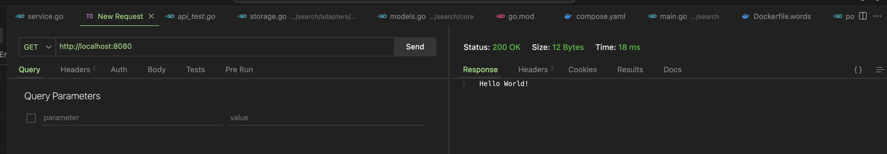
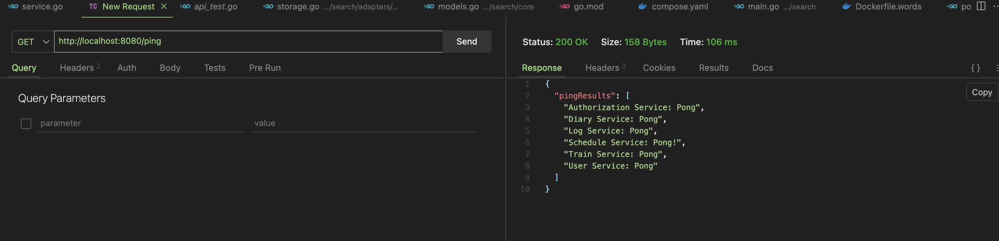

# Короткая инструкция по работе с проектом


У проекта предполагается два вида запуска, локальный и через контейнеры
## Требования к системе для запуска проекта локально

- Gradle 8.12.1
- Java 17
- [protoc libprotoc 29.3](https://grpc.io/docs/protoc-installation/) (для генерации proto файлов для работы с grpc)

## Требования к системе для запуска проекта через контейнеры
- Docker 27.4.0

# Запуск проекта локально
TODO оно же FIXME оно же ps:\
На текущий момент я не закинул конфигурационные файлы и не планирую это в ближайшее время делать. Для локальной развертки
либо используйте hard coding, либо сетьте env
Подготовил shell скрипт с аналогичными env 
```shell
source set_env.sh
```

```shell
./gladlew runAll
```

Важно, все процессы запускаются в фоне, поэтому для отслеживания используйте
```shell
ps aux | grep java
```

Чтобы все остановить
```shell
killall -9 java
```

# Запуск проекта через контейнеры
```shell
docker compose up -d
```

# Протыкивание ручек без gateway
Для протыкивания ручек без gateway можно использовать [grpcurl](https://github.com/fullstorydev/grpcurl) или [grpcui](https://github.com/fullstorydev/grpcui)
grpcurl
```shell
grpcurl -plaintext localhost:23210 list 
grpcurl -plaintext -d {} localhost:23210 search.Authorization/Ping
```
grpcui
```shell
grpcui -plaintext localhost:23210
```

NB: на текущий момент докеры и docker compose запущен минимально для демонстрации работы
необходимо перенастроить и добавить возможность парсить конфиг через ENV у докера

На текущий момент существует аж две ручки
```shell
curl localhost:8080
```
Возвращает `Hello world`


И ручка, которая возвращает массив микросервисов с их ответом на пинг
Если бы пинг не прошел, ответ микросервиса `gateway` был бы Unavailable



## Отметка директории, как модуля(для IntelliJ IDEA)
Если idea не отмечает директорию как микросервис, то есть нет синей пометочки возле директории(как на фото)


То необходимо зайти в директорию и прилинковать gradle к idea

